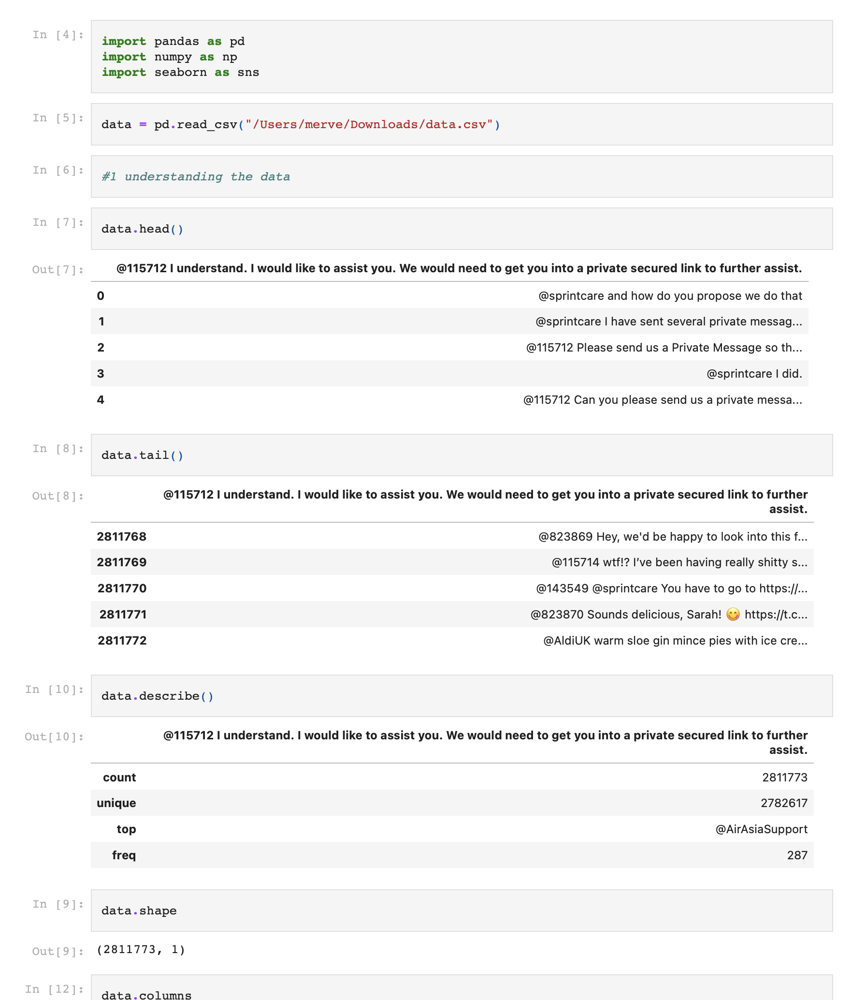
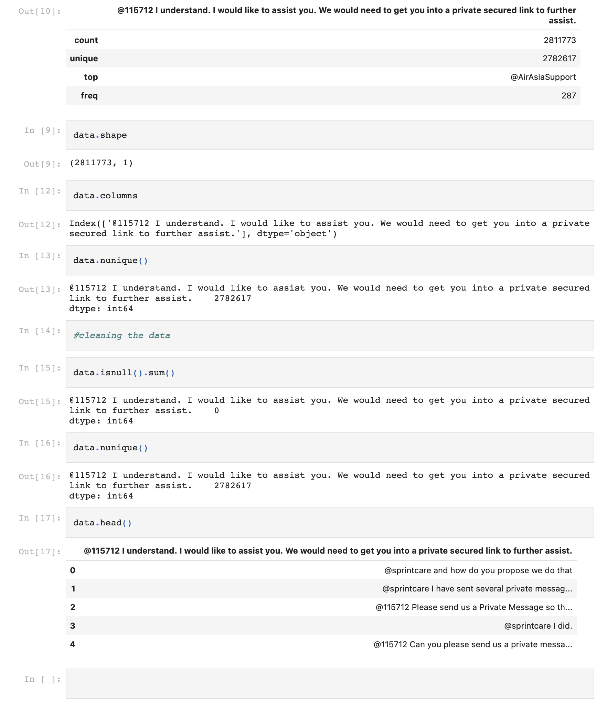

# ciphixmachinelearningcase

Machine Learning Case Ciphix

1. <b>Use Python.</b> 
<i>I have created a project in github to keep track of everything. I am using python for the case.</i>

2. <b>Perform EDA on your data.</b> 
<i>I actually didn't know what EDA was. I did a little research on internet. What I understand is that exploratory data analysis, is an approach to research data for content features, coherence, explanatory or predictive properties. I have used Jupyter. This is the first time I've worked with it. With this I looked at what I could get out of the big csv file.
 
</i>

3. <b>Preprocess your data appropriately. Think about punctuations, emoticons that should be removed from the raw text. The cleaner your data, the better the results!</b> 
<i></i>

4. <b>Explore different (pre/pst) processing methods and explain which is best.</b>
<i> Both pre-processing and post-processing scripts run before an item or entry is saved. The difference between them is that pre-processing scripts runs before the value and validation rules checking is complete, and post-processing scripts run after these processes.

What is pre processing and what is post processing.
<b>pre processing</b>: This is a pre-processing of data with a specific technique. In this process, unprocessed data is converted into an understandable format. Because real-world data is often incomplete or missing certain things.

Techniques:
- Data Cleaning: Data is cleansed through processes such as filling in missing values or deleting rows with missing data, smoothing the noisy data, or resolving the inconsistencies in the data. Smoothing noisy data is particularly important for ML datasets, since machines cannot make use of data they cannot interpret. Data can be cleaned by dividing it into equal size segments that are thus smoothed (binning), by fitting it to a linear or multiple regression function (regression), or by grouping it into clusters of similar data (clustering).

- Data integration: Data with different representations are put together and conflicts within the data are resolved.

- Data Transformation: Data is normalized and generalized. Normalization is a process that ensures that no data is redundant, it is all stored in a single place, and all the dependencies are logical.

- Data reduction: When the volume of data is huge, databases can become slower, costly to access, and challenging to properly store. Data reduction step aims to present a reduced representation of the data in a data warehouse.

<b>Post processing</b>: Its goal is to extract "pieces" of knowledge from usually very large databases. ... Postprocessing procedures usually include various pruning routines, rule filtering, or even knowledge integration.

Techniques: 
- Knowledge filtering: Rule truncation and postpruning.
If the training data is noisy then the inductive algorithm generates leaves of a decision tree or decision rules that cover a very small number of training objects. This happens because the inductive (learning) algorithm tries to split subsets of training objects to even smaller subsets that would be genuinely consistent. To overcome this problem a tree or a decision set of rules must be shrunk, by either postpruning (decision trees) or truncation (decision rules).

- Interpretation and explanation: Now, we may use the ac- quired knowledge directly for prediction or in an expert system shell as a knowledge base. If the knowledge discovery process is performed for an end-user, we usually document the derived re- sults. Another possibility is to visualize the knowledge [9], or to transform it to an understandable form for the user-end. Also, we may check the new knowledge for potential conflicts with previ- ously induced knowledge. In this step, we can also summarize the rules and combine them with a domain-specific knowledge pro- vided for the given task.

- Evaluation: After a learning system induces concept hypothe- ses (models) from the training set, their evaluation (or testing) should take place. There are several widely used criteria for this purpose: classification accuracy, comprehensibility, computational complexity, and so on.
 
- Knowledge integration: The traditional decision-making systems have been dependant on a single technique, strategy, model. New sophisticated decision-supporting systems combine or refine results obtained from several models, produced usually by different methods. This process increases accuracy and the likeli- hood of success.
</i>

5. <b>Use at least 3 machine learning algorithms in order to make sense of the
data.</b>
<i></i>

6. <b>Choose the best method by evaluation the different algorithms. Present
these findings, in a way which we can easily understand what you did.</b>
<i></i>

7. <b>Provide us with the top 10 question/types of conversations.</b>
<i></i>

8. <b>Your code should contain a notebook, which will guide as through your
project.</b>
<i></i>

9. <b>Don’t forget to add a readme to your project.</b>
<i></i>

10. <b>Bonus: deploy your best model and explain how we can use it.</b>
<i></i>
